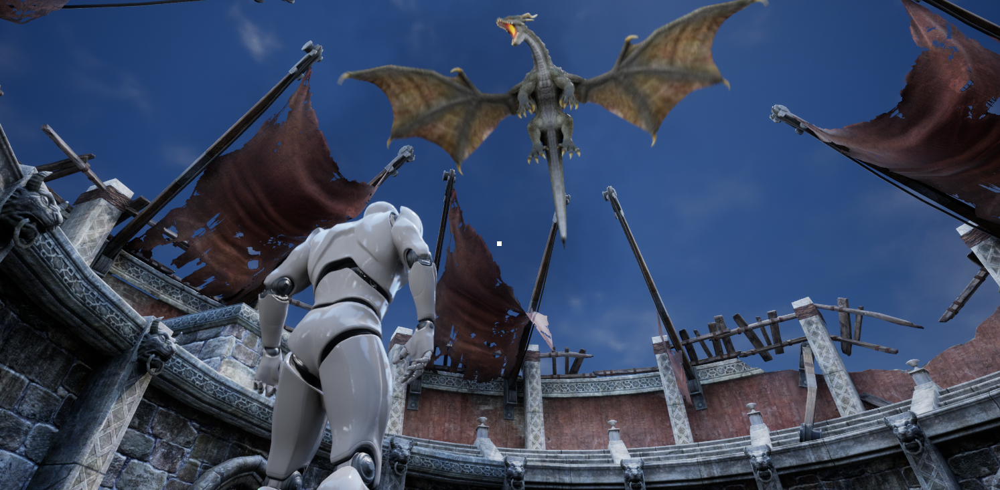
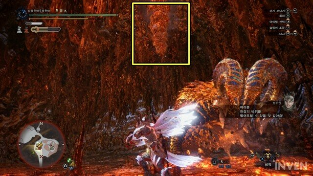
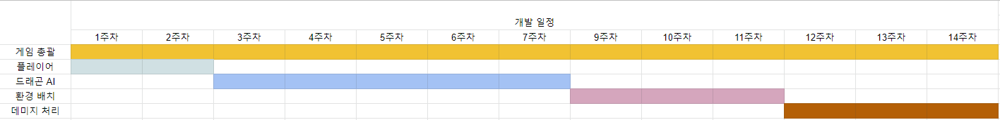

# 프로젝트명: Chaos Hunter
## 목차
1. [게임 개요](#게임-개요)
2. [대표 이미지](#대표-이미지)
3. [관련 이미지](#관련-이미지)
4. [게임 소개](#게임-소개)
5. [구성 요소](#구성-요소)
6. [요구사항](#요구사항)
7. [개발 작업](#개발-작업)

## [게임 개요]
### 메인 컨셉
#### 도전과제
1. 몬스터를 처치한다.
2. 지형을 파괴한다.
#### 재미요소
1. 지형지물과의 상호작용을 통해 신선한 경험을 제공할 수 있다.
2. 무기가 없는 새로운 방식의 전투로 색다른 경험을 제공할 수 있다.
3. 화려한 그래픽 요소를 감상할 수 있음
4. 몬스터를 토벌해서 성취감을 얻을 수 있다.
#### 카메라 관점
카메라 관점은 Main Viewport에서는 3인칭 관점으로 진행합니다.
플레이어의 회전에 따라 카메라도 함께 회전하기 때문에 카메라는 플레이어의 등만 비춥니다.
#### 플레이 방식
1. 플레이어가 콜로세움(맵)에 입장하면 몬스터가 어그로 추적을 시작하며 공격을 시작한다.
2. 유저는 WASD로 움직이며 좌클릭으로 돌멩이를 던질 수 있다. (화면 가운데에 CrossOver가 존재)
3. 돌멩이를 던져 지형에 맞으면 지형이 파괴되며 파편이 주변으로 튀거나, 떨어지게 된다.
4. 몬스터가 파편에 맞게 되면 데미지를 입게 된다.
5. 몬스터에게 죽으면 처음부터 다시 시작한다.

## [대표 이미지]

  

## [관련 이미지]

  

## [게임 소개]
언리얼엔진5의 나나이트와 카오스 디스트럭션 기능을 사용하여 플레이어가 최대한 즐길 수 있는 게임을 만들었습니다.
몬스터에게 공격할 수 있는 수단은 카오스 디스트럭션을 이용하여 기존에 있는 지형 또는 오브젝트를 파괴시켜 데미지를 줄 수 있으며
적 드래곤이 공격해오는 공격을 피하며 적절하게 파괴시킨 파편을 맞추어 드래곤을 쓰러뜨리면 이기는 게임입니다.

## [구성 요소]
1) 오브젝트 이름: BP_AIDragon

|속성|영문명칭|설명|
|---|----|-------------------|
|Pawn|Target|AI가 쫒아가서 공격할 타겟 레퍼런스|
|Int|AttackCounts|어떤 공격을 할 것인지 나타내는 변수|
|EAttackType|AIAttackType|어떤 공격을 할 것인지 나타내는 구조체 변수|
|Float|AttackDistance|타겟과 자신의 거리|
|Float|MaxHP|드래곤의 최대 HP|
|Float|CurHP|드래곤의 현재 HP|
|Float|KnockBackDistance|넉백되는 거리|
|Int|FlyCoolDown|한 번 날아오르는 패턴 후 다시 날아오르는데까지의 카운트|
|Float|DragonSpreadFireRange|드래곤이 불을 뿜고 지면에 닿았을 때 데미지를 주는 범위|
|Bool|Fly?|현재 날고있는지 아닌지 판별하는 변수|
|BPA_FireBall|SpawnedFireBall|불 오브젝트|
|Int|FireCount|불을 몇 번 쐈는지에 대한 카운트|

## [요구사항]

1. 게임을 시작하면 화면에 Crosshair가 보인다.
2. 게임을 시작하면 화면 왼쪽 하단에 자신의 캐릭터의 등이 보인다.(3인칭)
3. 이동 또는 시점회전을 해도 화면상에서는 플레이어는 그대로 보이고 맵이 움직이는 것처럼 보인다.
4. 맵에 Chaos Destruction이 적용된 몇몇 오브젝트들이 보이며 조준점과 오브젝트가 일치한 상태에서 좌클릭을 하면 오브젝트가 파괴되면서 파편이 튀게 된다.
5. Space키를 누르면 점프를 한다.
6. 체력이 0이 되면 사망 애니메이션이 재생되고, 컨트롤할 수 없게 된다.
7. 사망하게 되면 재시작을 할 수 있는 버튼이 나오게 된다.
8. 좌클릭(돌 던지기)은 2초의 쿨타임이 존재하며 쿨타임에는 좌클릭을 해도 아무것도 일어나지 않는다.
9. 몬스터는 플레이어와의 거리가 600미만일 때 근접공격을 시행함.
10. 몬스터는 플레이어와의 거리가 600~1500사이일 때 원거리 공격을 시행함.
11. 몬스터는 매 패턴마다 20%의 확률로 공중으로 날아올라 공중 공격을 시행함.
12. 몬스터는 공중 공격을 마치고 땅으로 내려오면 20초 동안 다시 공중 공격을 시행할 수 없음.
13. 플레이어는 드래곤의 등에 올라탈 수 있으며 드래곤의 목 뒤쪽에 약점이 존재하여 그곳을 공격할 수 있음(좌클릭)
14. 플레이어의 HP가 0보다 크고 몬스터의 HP가 0이하로 떨어지면 드래곤은 사망 애니메이션을 출력하며 움직이지 않게 된다.
15. 몬스터가 사망하면 재시작을 할 수 있는 버튼이 나오게 된다. 

## [개발 작업]

